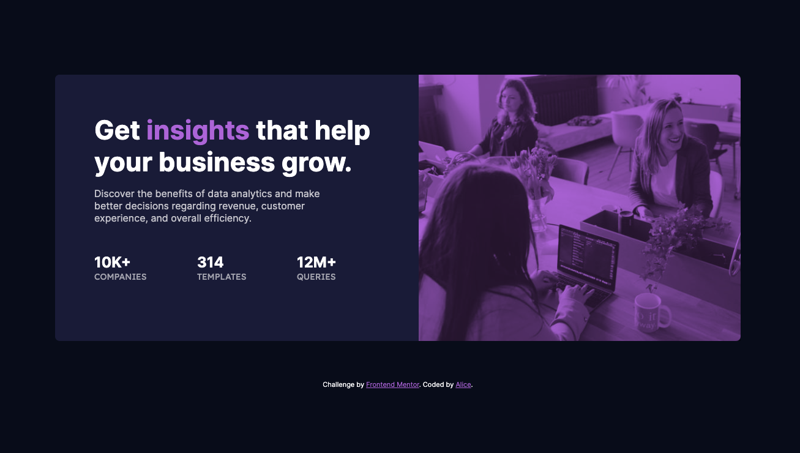

# Frontend Mentor - Stats preview card component solution

This is a solution to the [Stats preview card component challenge on Frontend Mentor](https://www.frontendmentor.io/challenges/stats-preview-card-component-8JqbgoU62). Frontend Mentor challenges help you improve your coding skills by building realistic projects. 

## Table of contents

- [Overview](#overview)
  - [The challenge](#the-challenge)
  - [Screenshot](#screenshot)
  - [Links](#links)
- [My process](#my-process)
  - [Built with](#built-with)
  - [What I learned](#what-i-learned)
- [Author](#author)

## Overview

### The challenge

Users should be able to:

- View the optimal layout depending on their device's screen size

### Screenshot




### Links

- Solution URL: [Add solution URL here](https://your-solution-url.com)
- Live Site URL: [Add live site URL here](https://your-live-site-url.com)

## My process

### Built with

- Semantic HTML5 markup
- CSS custom properties
- Flexbox

### What I learned

I never knew about the css ` mix-blend-mode: ` property. 
I had fun playing around with its various attributes until I landed with `multiply`.

```css
.proud-of-this-css {
  mix-blend-mode: multiply;
}
```

## Author

- Website - [Alice Menzie](https://www.alicemenzie.dev)
- Frontend Mentor - [@AliceMenzie](https://www.frontendmentor.io/profile/AliceMenzie)
- Github- [AliceMenzie](https://github.com/AliceMenzie)
